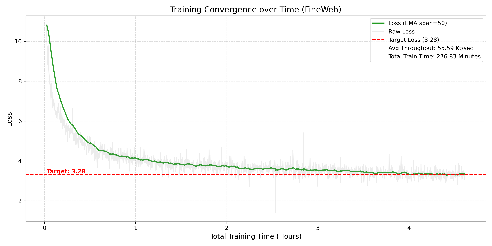
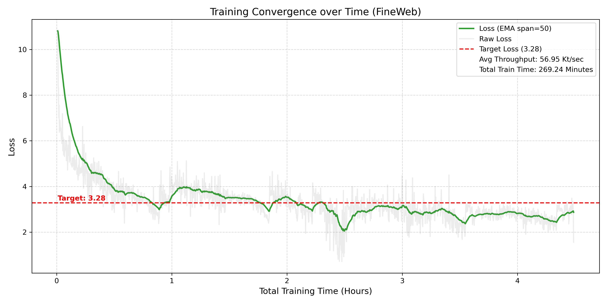

# NanoGPT-from-scratch-with-muon (Work in Progress)

This repository contains a highly optimized training recipe to "speedrun" a GPT-2 124M-class model to < 3.28 validation loss (the OpenAI baseline) using a single consumer laptop GPU.

3.28 Validation Loss takes about 240 mins for **[FineWeb](https://huggingface.co/datasets/HuggingFaceFW/fineweb)** dataset and 150 mins for **[Nemotron-ClimbMix](https://huggingface.co/datasets/nvidia/Nemotron-ClimbMix)** dataset. 

### Loss curve for FineWeb dataset

### Loss curve for Climbmix dataset

🛠 Features & Architecture

We use a "Modded-NanoGPT" architecture that deviates from the 2019 original to maximize hardware utilization:

    Muon Optimizer: A Newton-Schulz-style optimizer that orthogonalizes matrix parameters, leading to significantly faster convergence than AdamW.

    U-Net Skip Connections: Enhances gradient flow by connecting early encoder layers to later decoder layers.

    Value Embeddings: Triple-stream value_embeds tables that add model capacity without increasing FLOPs.

    FlexAttention: Leverages torch.nn.attention.flex_attention with document-causal masking for superior memory efficiency.

    Modern Stabilizers: Rotary Positional Embeddings (RoPE) and Tanh Logit Scaling (30×tanh(x/30)) to prevent FP8/BF16 overflows.

💻 Hardware Optimization (RTX 5070 Laptop)

To run this on a laptop with 8GB VRAM (standard for 5070 Mobile):

## Key Ideas & Features
.

### Model Architecture
* **GPT-2-style, 124M scale:** 12 layers, 6 heads, 768-dim embedding.
* **Value Embeddings:** Three distinct `value_embeds` tables injected into attention as alternative value streams (adds capacity without FLOPs).
* **U-Net Skip Connections:** Long skip connections from encoder layers to decoder layers to improve gradient flow.
* **Rotary Embeddings (RoPE):** Replaces standard learned positional embeddings.
* **Tanh Logit Scaling:** Final logits are scaled `logits = 30 * tanh(logits / 30)` to stabilize FP8/BF16 training.

### Optimization & Efficiency
* **Muon Optimizer:** A Newton-Schulz-style optimizer for matrix parameters that orthogonalizes weights, providing massive convergence speedups.
* **FlexAttention:** Uses `torch.nn.attention.flex_attention` with custom block masks for document-causal masking.
* **Async Data Loading:** Custom `AsyncDataLoader` with pinned memory to saturate the GPU (zero PCIe bottlenecks).
* **Curriculum Learning:** Progressive context window (starts at 256, ends at 1792) to save compute in the early phase.
* **FP8 Training:** Enabled via `torchao` for linear layers.

---

